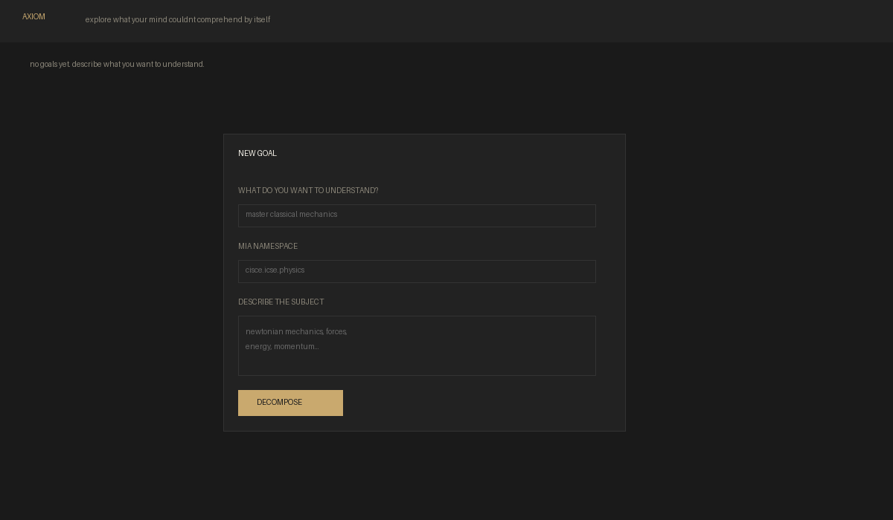

# AXIOM

**explore what your mind couldnt comprehend by itself**



---

hey. i'm vedant. i'm 16 and i built this.

axiom is a cognitive research platform — basically it models how your brain actually understands stuff as a dependency graph. not flashcards. not spaced repetition. actual prerequisite chains.

you tell it what you want to learn. an AI decomposes it into concepts and maps their dependencies. then when you forget something, axiom walks backward through the graph and finds the exact foundational concept you actually broke. you repair that one thing, and knowledge cascades upward automatically.

it's like a debugger for your brain.

## what it actually does

1. you describe a subject ("i want to understand quantum mechanics")
2. AI breaks it into prerequisite concepts with a directed dependency graph
3. every concept gets a strictly enforced namespace (`cisce.icse.chemistry.redox`)
4. you click nodes, trace your understanding, find what's broken
5. when you forget something, the algorithm walks backward to find the root cause
6. you repair it, and the repair cascades through dependents
7. your brain state is tracked in localStorage — exportable as JSON, importable anywhere

## the trace algorithm

this is the core. when you fail to recall "rotational dynamics":

```
rotational ← momentum ← newtons_laws ← vectors
     ↓
networkx reverses the graph, runs DFS backward
     ↓
finds CALCULUS as the deepest broken prerequisite
     ↓
marks it broken. you repair it. cascade begins.
```

it's not a toy. it uses `nx.descendants()` on the reversed graph, filters to unknown nodes, and picks the one at maximum depth. that's your root cause.

## brain simulation

this is the part i care about most. everything you do — every node you inspect, every trace you trigger, every repair you complete — gets recorded in your browser's localStorage.

- **export** your brain state as a timestamped JSON file
- **import** a previous brain state to restore your cognitive map
- **the data is designed for future AI analysis** — your interaction patterns, which concepts you struggle with, how your understanding evolves over time

this is the beginning of a system that can eventually simulate how YOU think about a subject.

## run it

```bash
cd theAxiom
py -m venv .venv
.venv\Scripts\pip install -r requirements.txt
.venv\Scripts\python manage.py migrate
.venv\Scripts\python manage.py runserver
```

open http://127.0.0.1:8000/

## build the EXE

```bash
build_exe.bat
```

output: `dist\Axiom\Axiom.exe`

double-click it. it opens in your browser. 

## the namespace system (CID)

every concept in axiom gets a dot-separated identifier:

```
cisce.icse.chemistry.redox.oxidation_state
^         ^     ^         ^    ^
board     std   subject   unit concept
```

this prevents collisions. "O.S." could mean Operating System or Oxidation State. the namespace makes it unambiguous. this is a real problem in knowledge graphs and i solved it.

## research doc

there's a full research document in [RESEARCH.md](RESEARCH.md) covering:
- free hosting options (Railway, Render, Fly.io, PythonAnywhere)
- technical architecture deep-dive
- deployment strategy
- performance benchmarks
- security considerations

Jai Maa Kali, Jai Shree Hari, Jai MahaKaal Vishwanath.